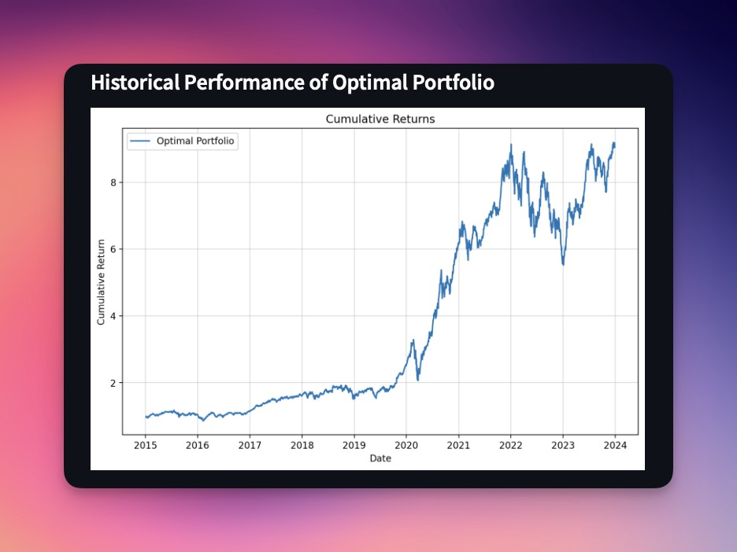
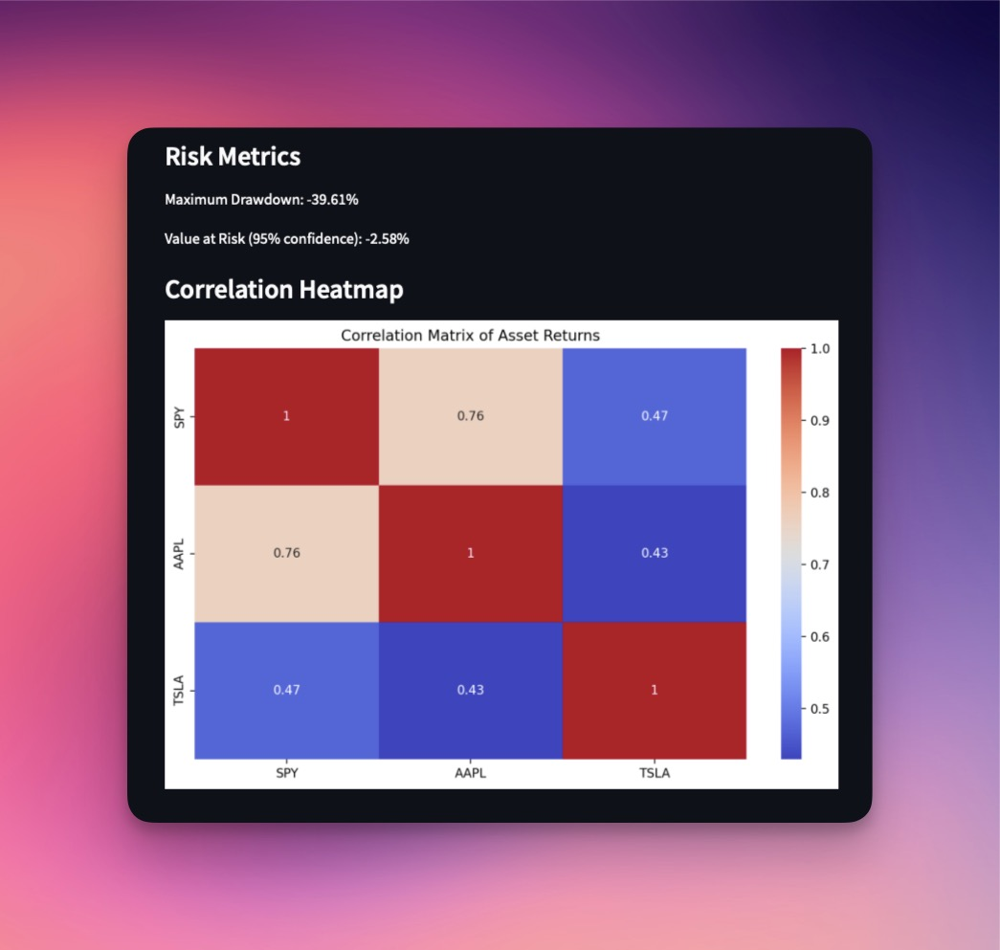
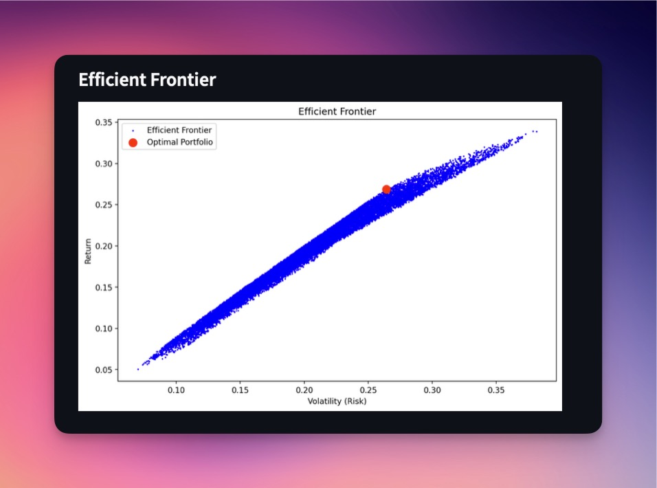

# Monte-Carlo-Portfolio-Optimisation

Unlock the power of data-driven investment strategies with our Monte Carlo Portfolio Optimization app! This interactive web-based tool empowers investors, financial analysts, and enthusiasts to design optimal portfolios by simulating thousands of potential asset allocations, all through an intuitive and easy-to-use interface.

# What Does the App Do?

This app combines Modern Portfolio Theory (MPT) with Monte Carlo simulations to:
* Analyze historical performance: Retrieve and visualize historical price data for your chosen assets
* Optimize portfolios: Simulate thousands of portfolio combinations to find the best allocation for your assets
* Maximize returns and manage risk: Identify the portfolio with the highest Sharpe Ratio while understanding key risk metrics like Maximum Drawdown and Value at Risk

# Why use this app?
  ## Customizable Simulations:
  * Choose your own stocks, risk-free rates, and portfolio constraints.
  * Simulate up to 100,000 portfolio scenarios to explore a wide range of allocations.
## Powerful Analytics:
* Evaluate critical metrics like Maximum Drawdown and Value at Risk (VaR).
* Visualize asset correlations with a heatmap.
* Trace the Efficient Frontier and pinpoint your portfolio’s optimal allocation.
## Interactive and Accessible:
* Built with Streamlit, the app provides a responsive and user-friendly interface.
* No coding required—run, adjust, and optimize portfolios in just a few clicks.


## Features

- **Interactive Input Options:**
  - Date range selection for historical data
  - Custom stock tickers
  - Configurable risk-free rate and number of simulations
  - Adjustable weight constraints for each asset
  
- **Optimization and Analysis:**
  - Portfolio optimization using Modern Portfolio Theory
  - Calculation of key risk metrics: Max Drawdown, Value at Risk (VaR)
  - Efficient Frontier visualization and optimal portfolio identification

- **Visualizations:**
  - Historical performance of the optimal portfolio
  - Correlation heatmap of asset returns
  - Efficient Frontier with risk and return scatter plot

- **Report Generation:**
  - Downloadable CSV file with optimal weights, expected return, volatility, Sharpe ratio, and risk metrics.

## How It Works

1. **Input Parameters:** Users provide stock tickers, date range, and simulation parameters via the sidebar.
2. **Data Fetching:** Historical price data is fetched using `yfinance` for the given tickers and date range.
3. **Monte Carlo Simulations:** Simulates numerous portfolio allocations within user-defined constraints.
4. **Optimization:** Identifies the portfolio with the highest Sharpe ratio.
5. **Visualization and Metrics:** Generates plots and calculates risk metrics for user review.

## Dependencies

- **Python Libraries:**
  - `streamlit`: Web application framework
  - `yfinance`: Fetching stock price data
  - `pandas`: Data manipulation
  - `numpy`: Numerical computations
  - `matplotlib`: Data visualization
  - `seaborn`: Correlation heatmap generation

Install dependencies manually by using:
```bash
pip install streamlit yfinance pandas numpy matplotlib seaborn
````

# Usage 

1. Clone the repository:
   ```bash
   git clone https://github.com/ionutnodis/monte-carlo-portfolio-optimization.git](https://github.com/ionutnodis/Monte-Carlo-Portfolio-Optimisation/tree/main
   cd Monte-Carlo-Portfolio-Optimization

2. Install the required dependencies from the requirements file:

  ```bash
pip install -r requirements.txt

`````

3. Run the application:
```` bash

streamlit run portfolio-optimization.py

````
3. Open the provided URL in your browser to access the app

# File Overview 

* portfolio-optimization.py: Main application script containing the Python code
* requirements.txt: Requirements needed to install for the application to run
* README.md: Documentation for the project

# Key Sections in the App 

* Historical Performance: Visualize historical cumulative returns for the optimal portfolio
* Risk Metrics: Includes Maximum Drawdown and Value at Risk (VaR: 95% confidence level)
* Correlation Heatmap: Displays the relationships between the included assets returns
* Efficient Frontier: Shows the trade-off between risk and return for simulated portfolios

## Example of Outputs 

### Historical Cumulative Returns 


### Correlation Heatmap 




### Efficient Frontier 



# References 

1.	Hull, J. C. (2018). Options, Futures, and Other Derivatives (10th Edition). Pearson Education.
2.	Huang, C.-F., & Litzenberger, R. H. (2012). Intermediate Financial Theory (3rd Edition). Academic Press.

# Contributing 
Contributions are welcomed! Please fork the repository and submit a pull request for review. 

# License
This project is licensed under the MIT License. See the LICENSE file for details.

# Author 
Developed by Ionut Catalin Nodis. If you have any questions or suggestions, feel free to reach out!


